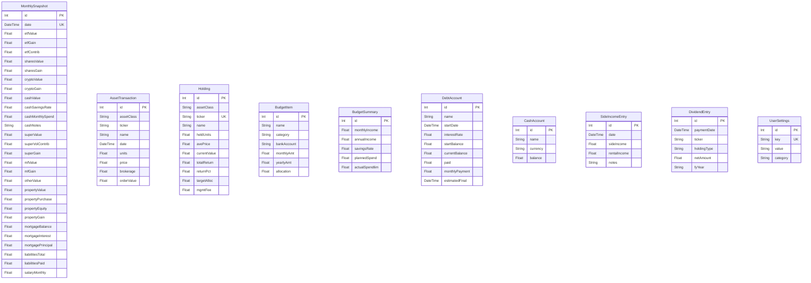

# feat: CompiledSanity Finance Dashboard

## Overview

Port El Diablo's "Linh's Compiled Finance - Master v2 (as of 2026).xlsx" — a CompiledSanity Personal Savings Sheet v2.14 with 20 tabs — into the existing Next.js 15 finance-dashboard app as a read-only interactive dashboard. Bootstrapped by importing the xlsx, with ongoing manual entry via a "Record Net Worth" modal.

## Data Flow Architecture

```
Individual Asset Tabs (raw entry)
  ETFs: transaction table → computed holdings value
  Stocks: transaction table → computed portfolio value
  Cash: account balances → computed totals
  Debts: loan details → computed balances
  Budget: manual line items → budget totals
  Super: balance entry → super history
  Side Income: monthly entries → YTD totals
        ↓
Net Worth Sheet (aggregation)
  Reads from each asset tab → computes Total Assets / Total Liabilities / Net Worth
        ↓
History Sheet (canonical time-series)
  Monthly snapshots of all computed values — the spine of all charts
```

**Import strategy**:
1. `History` sheet → `MonthlySnapshot` table — time-series backbone (10 months of data)
2. Individual current-state tabs → current position data (ETF holdings, debt accounts, budget lines)
3. Transaction tables in ETF/Stocks/MF tabs → individual trade history
4. Cannot recompute Google Finance live price values — import already-evaluated values from History

## Existing Infrastructure (Reuse)

| Asset | Path |
|-------|------|
| Prisma + SQLite singleton | `lib/db.ts` |
| AUD formatter `fmt()`, number `fmtN()` | `lib/formatters.ts:1` |
| Section card wrapper | `components/shared/Section.tsx` |
| Label/value row | `components/shared/Row.tsx` |
| Range slider | `components/shared/Slider.tsx` |
| Recharts sparkline | `components/SparklineChart.tsx` |
| Property calculator (embed in PropertyTab) | `components/PropertyCalculator.tsx` |
| xlsx npm package | Already in `package.json` |
| recharts npm package | Already in `package.json` |

## ERD (New Models)



## Implementation Plan

### Phase 1: Test Infrastructure + Data Layer

#### 1.1 Add Vitest
- `vitest.config.ts` — jsdom environment, path aliases (`@/` → project root)
- `package.json` — add `vitest`, `@vitejs/plugin-react`, `@testing-library/react`, `jsdom`

#### 1.2 Extend Prisma Schema
Add 9 new models to `prisma/schema.prisma`:
`MonthlySnapshot`, `AssetTransaction`, `Holding`, `BudgetItem`, `BudgetSummary`, `DebtAccount`, `CashAccount`, `SideIncomeEntry`, `DividendEntry`, `UserSettings`

Run `npx prisma migrate dev --name finance-dashboard`

#### 1.3 xlsx Parser Library (TDD — RED first)

**Test file**: `lib/__tests__/xlsx-parser.test.ts`
- `excelDateToJs(serial)` — Excel date serial → JS Date
- `parseHistorySheet(wb)` → `MonthlySnapshotData[]`
  - Known value: serial 46112 = 2026-03-01, etfValue=10862.05
  - History columns: A=date, B-E=Stocks, F-I=ETFs, J-M=Crypto, N-P=Cash, Q-T=Super, U-V=Liabilities, W=Salary, X-AE=Property, AF-AI=Managed Funds, AJ-AK=Other Assets
- `parseBudgetSheet(wb)` → `{ summary, items }` — income=$8711, mortgage=$2826
- `parseDebtSheet(wb)` → `DebtAccountData[]` — HELP balance = -$38797
- `parseCashSheet(wb)` → `{ accounts, history }`
- `parseETFSheet(wb)` → `{ holdings, transactions }` — DHHF 80 units @ $36.75
- `parseSideIncomeSheet(wb)` → `SideIncomeData[]` — rental Mar 25 = $1700
- `parseDividendSheet(wb)` → `DividendData[]`
- `parseUserSettings(wb)` → `UserSettingData[]`

**Implementation file**: `lib/xlsx-parser.ts`

**XLSX path**: `/home/duy/Downloads/Linh's Compiled Finance - Master v2 (as of 2026).xlsx`

**Security note**: Do NOT import CoinMarketCap API key (SheetOptions row L29).

#### 1.4 Import API Route

**File**: `app/api/finance/import/route.ts`

```
POST /api/finance/import
Body: { useDefault: true }   // uses hardcoded xlsx path at ~/Downloads/
// OR multipart with xlsx file

Response: { imported: { snapshots: N, holdings: N, debts: N, ... }, errors: string[] }
```

Upsert strategy: `upsert` on `date` for MonthlySnapshot, `upsert` on `ticker` for Holding.

#### 1.5 Remaining API Routes

| Route | Returns |
|-------|---------|
| `GET /api/finance/snapshots` | `MonthlySnapshot[]` sorted by date |
| `GET /api/finance/net-worth` | Latest NW computed from last snapshot |
| `GET /api/finance/holdings` | `Holding[]` grouped by assetClass |
| `GET /api/finance/budget` | `{ summary: BudgetSummary, items: BudgetItem[] }` |
| `GET /api/finance/debts` | `DebtAccount[]` |
| `GET /api/finance/income` | `{ sideIncome: SideIncomeEntry[], dividends: DividendEntry[] }` |

Note: Prefer server-side DB queries in page.tsx/tab components over API calls.

### Phase 2: Dashboard Shell + Navigation

#### 2.1 Nav Updates
- `components/PropertyCalculator.tsx` — add "Dashboard" nav link
- `app/market-indicators/page.tsx` — add "Dashboard" nav link

#### 2.2 Dashboard Page

**File**: `app/dashboard/page.tsx` — Next.js Server Component

Tab structure:
```
Overview | Net Worth | Cash | Investments | Budget | FIRE | Debts | Property | Income
```

Also include "Record Net Worth" button → modal form (upserts current month snapshot).

### Phase 3: Net Worth + Cash + Investments Tabs

#### 3.1 `components/dashboard/OverviewTab.tsx`
- Hero KPI strip: Net Worth ($184,933) | Total Assets ($710,511) | Total Liabilities (-$525,578) | Savings Rate
- Net Worth history area chart (AreaChart from recharts, all MonthlySnapshot dates)
- Asset allocation ring chart (ETFs, Cash, Super, Property, Crypto split)
- Last recorded date

#### 3.2 `components/dashboard/NetWorthTab.tsx`
- Asset table: each class → value, gain $, gain %
- Stacked area chart: all asset classes over time
- NW rolling line chart with month-over-month delta annotation

#### 3.3 `components/dashboard/CashTab.tsx`
- Accounts list (from CashAccount)
- Monthly cash history bar chart with savings rate overlay
- Spend notes timeline (cashNotes from MonthlySnapshot)
- EOY goal badge ($20,000 target from UserSettings)

#### 3.4 `components/dashboard/InvestmentsTab.tsx`
Sub-tabs: **ETFs | Stocks | Crypto | Managed Funds**

Each sub-tab:
- Portfolio value card, total return card
- Holdings table: ticker, name, units, ave price, live value, return %, target alloc, deviation
- Allocation donut vs target (from UserSettings)
- Historical value chart from MonthlySnapshot

#### 3.5 `components/dashboard/SuperTab.tsx`
- Balance card, voluntary contributions YTD
- Super history chart from MonthlySnapshot.superValue
- Growth rate annotation

### Phase 4: Budget + FIRE + Debts

#### 4.1 `components/dashboard/BudgetTab.tsx`
- Income header: $8,711/mo | $104,533/yr after tax
- Needs/Wants/Savings donut chart
- Budget line items table (name, category, monthly $, yearly $, allocation %)
- Planned vs 6m actual spend comparison
- Emergency fund coverage badge (6 months target from UserSettings)

#### 4.2 `components/dashboard/FireTab.tsx`
- FIRE ETA card
- Pre-Super FIRE progress: current $127,511 / target ~$2.75M = 4.6% (RadialBarChart)
- Super FIRE progress
- Settings display: DOB 1994, withdrawal 4%, inflation 2.5%, super access 60
- Projection table: year-by-year accumulation → drawdown phase

#### 4.3 `components/dashboard/DebtsTab.tsx`
- Total liabilities card: -$525,578 (mortgage + non-mortgage)
- Non-mortgage breakdown: HELP (-$38,797), Credit Card (-$539), Solar (-$329), Personal Loan (-$10,105)
- Per-debt progress bar (paid / start balance)
- Paydown history chart from MonthlySnapshot.liabilitiesTotal
- Estimated payoff date per debt

### Phase 5: Property + Income + Capital Gains

#### 5.1 `components/dashboard/PropertyTab.tsx`
- Read-only metrics from MonthlySnapshot: purchase $602k, current $637k, equity $161k, gain $75.4k (13.4%)
- Property value history chart
- Mortgage paydown chart
- Equity growth chart
- Embed existing `<PropertyCalculator />` below (interactive what-if tool)

#### 5.2 `components/dashboard/IncomeTab.tsx`
- Rental income history bar chart from SideIncomeEntry
- YTD side income: $9,141
- Dividend history table from DividendEntry
- Total passive income tally

#### 5.3 `components/dashboard/CapitalGainsTab.tsx`
- CGT events from AssetTransaction (sells, units < 0)
- FIFO gain/loss per lot
- FY summary (CGT rates from UserSettings)

### Record Net Worth Modal

**File**: `components/dashboard/RecordNetWorthModal.tsx`

Form groups (mirrors History sheet columns):
- Investments: ETF value, Stocks, Crypto, Managed Funds
- Cash: Cash balance, savings rate %, spend notes
- Super: Balance, voluntary contributions YTD
- Property: Current value, mortgage balance
- Liabilities: Total non-mortgage debt

On submit → `POST /api/finance/snapshots` (upsert for first day of current month).

## Files to Modify

| File | Change |
|------|--------|
| `prisma/schema.prisma` | Add 10 new models |
| `lib/formatters.ts` | Add `fmtPct(n)`, `fmtDate(d)` helpers |
| `components/PropertyCalculator.tsx` | Add Dashboard nav link |
| `app/market-indicators/page.tsx` | Add Dashboard nav link |
| `package.json` | Add vitest + testing deps |

## New Files (implementation order)

```
vitest.config.ts
lib/__tests__/xlsx-parser.test.ts          (write RED tests first)
lib/xlsx-parser.ts                         (implement GREEN)
app/api/finance/import/route.ts
app/api/finance/snapshots/route.ts
app/api/finance/net-worth/route.ts
app/api/finance/holdings/route.ts
app/api/finance/budget/route.ts
app/api/finance/debts/route.ts
app/api/finance/income/route.ts
app/dashboard/page.tsx
components/dashboard/RecordNetWorthModal.tsx
components/dashboard/OverviewTab.tsx
components/dashboard/NetWorthTab.tsx
components/dashboard/CashTab.tsx
components/dashboard/InvestmentsTab.tsx
components/dashboard/SuperTab.tsx
components/dashboard/BudgetTab.tsx
components/dashboard/FireTab.tsx
components/dashboard/DebtsTab.tsx
components/dashboard/PropertyTab.tsx
components/dashboard/IncomeTab.tsx
components/dashboard/CapitalGainsTab.tsx
```

## Verification

1. **Unit tests**: `npx vitest run` — all xlsx parser tests green
2. **Migration**: `npx prisma migrate dev` — 10 new tables created, no errors
3. **Import**: `curl -X POST http://localhost:3000/api/finance/import -H "Content-Type: application/json" -d '{"useDefault":true}'`
   - Expect: `{ imported: { snapshots: 10, holdings: 4, debts: 5, ... } }`
4. **Dashboard** `npm run dev` → `/dashboard`:
   - Overview: Net Worth $184,933, 10 chart points
   - Investments ETF sub-tab: 4 holdings (DHHF, VAS, VGS, GOLD), total $10,862
   - Cash: balance ~$5,000, 10 months history
   - Budget: income $8,711/mo, 20+ line items, mortgage $2,826/mo
   - FIRE: Pre-Super 4.6% progress
   - Debts: HELP -$38,797, total liabilities -$525,578
5. **Build**: `npm run build` — zero TypeScript errors
